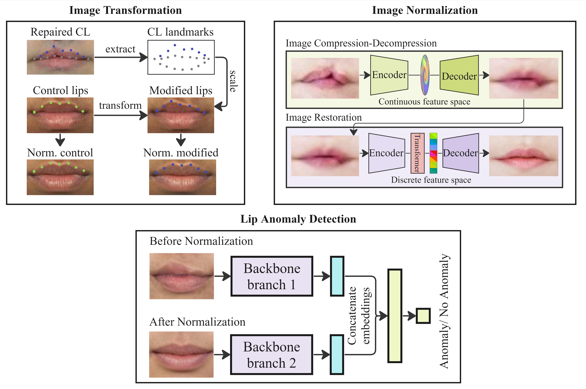

# ICMI2024-1257.github.io
Official repository of the paper "Lip Abnormality Detection for Patients with Repaired Cleft Lip and Palate: A Lips Normalization Approach" submitted to the 26th International Conference on Multimodal Interaction (ICMI 2024).

<p class="lead"> <b>Abstract:</b> The cleft lip condition arises from the incomplete fusion of oral and labial structures during fetal development, impacting vital functions. After surgical closure, patients commonly present with abnormal lip shape, which may require secondary revision surgery for both aesthetic and functional improvement. However, a lack of standardized evaluation methods complicates decision-making for secondary surgery. To address this limitation, we propose a transformer-based lips normalization approach that filters out abnormalities and achieves a standardized appearance while preserving individual anatomy. An innovation of our approach is a lip transformation method using available face datasets to mimic repaired cleft lip shapes, enabling the training of deep learning models without using patients' data. We employ a Siamese convolutional neural network that processes pre- and post-normalization images to detect lip abnormalities with an accuracy of 88.10%. We compare our approach with a single-branch model without lips normalization, which reached an accuracy of 65.80%. Our approach has the potential to provide an impartial view to determine the need for revision surgery while also assisting in the selection of healthcare tools specialized for patients with repaired cleft lip.</p>



## Installation

#### Clone this repository
```
git clone https://github.com/ICMI2024-1257/ICMI2024-1257.github.io.git
cd ICMI2024-1257.github.io
```

#### Create a conda environment based on yml file
```
conda env create -f icmi_env.yml
conda activate icmi_env
conda install conda-forge::insightface https://anaconda.org/conda-forge/insightface
```
#### Download weights
```
cd ICMI2024-1257.github.io
curl -L  https://utdallas.box.com/shared/static/ogvh8wz3ou6bga7p7xgtw90mr1rqz8ac --output weights.zip
unzip weights.zip 
cd third_party/CodeFormer
python basicsr/setup.py develop https://github.com/sczhou/CodeFormer/tree/master
python scripts/download_pretrained_models.py facelib
python scripts/download_pretrained_models.py dlib 
python scripts/download_pretrained_models.py CodeFormer
```

## Applying CLP transformations

1. Place all your control images in './data/samples'<br>
2. Apply CLP transformation on all control samples using the following command:
```
python lip_transformation.py --input_dir './data/samples/' --out_dir './data/samples_augment/'
```

## Applying lip normalization

1. Make sure your image directories are stored in './data/'<br>
2. Apply lip normalization on both control and augmented samples using the following commands:
```
python lip_normalization.py --input_dir './data/samples/' --outdir_process_orig './data/samples_process/' --outdir_norm './data/samples_norm/' --del_temps True
python lip_normalization.py --input_dir './data/samples_augment/' --outdir_process_orig './data/samples_augment_process/' --outdir_norm './data/samples_augment_norm/' --del_temps True
```
The parameter --del_temps True removes directories of the intermediate steps, i.e., the face compression-decompression stage and its preprocessing. If you want to keep the directories, use --del_temps False. <br>

